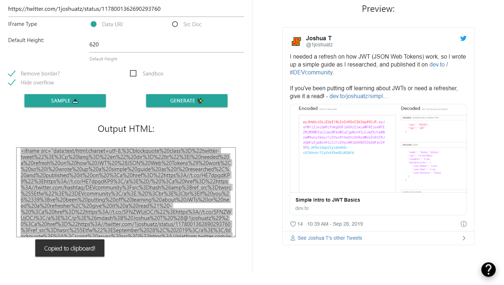

# Twitter Iframe Embed Generator

Live Tool: [Glitch Hosted](https://joshuatz-twitter-iframe-generator.glitch.me/)

## Important Links
 - 📝: [Project Page](https://joshuatz.com/projects/web-stuff/twitter-iframe-embed-generator/)
 - 

## What is this?
Tiny tool to generate an `<iframe>` embed from any given tweet, which you can then use on any site that accepts them, or in your own code.

## Why?
The default embed code that Twitter gives you requires a high level of trust; you have to load third-party external JavaScript onto your site, which could potentially be exploited.

## Downsides
See [my project post](https://joshuatz.com/projects/web-stuff/twitter-iframe-embed-generator/) for more details, but to summarize:

 - This method does not allow for responsive embeds
 - Embeds could potentially get blocked by users who have disabled iframe content

## Disclaimers
This tool is not affiliated with Twitter in any official capacity. Please use it responsibly, adhering to the Twitter TOS, and your local laws and regulations.
